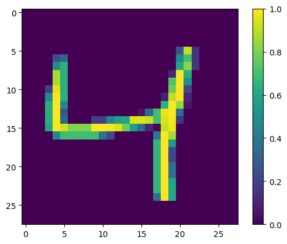
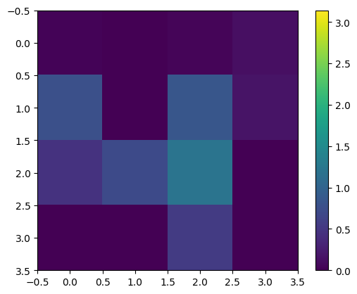
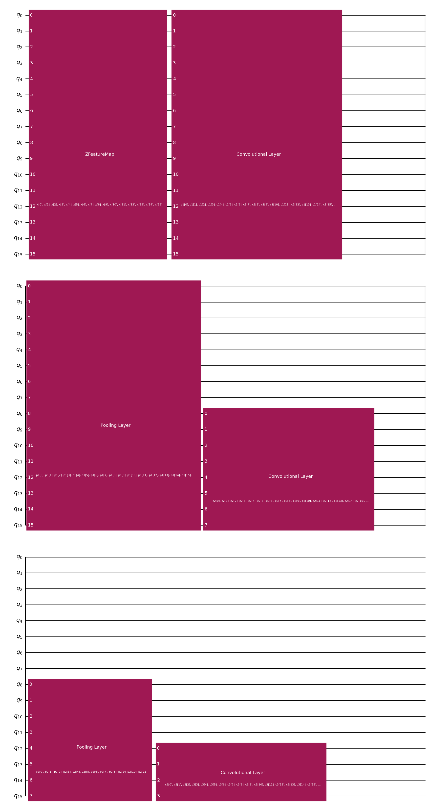
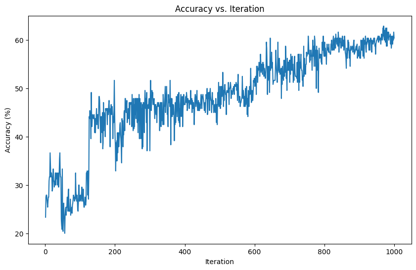
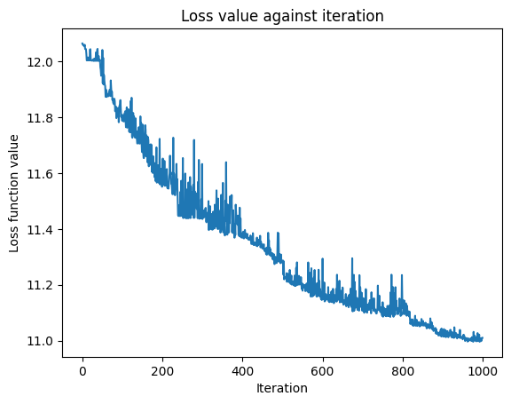
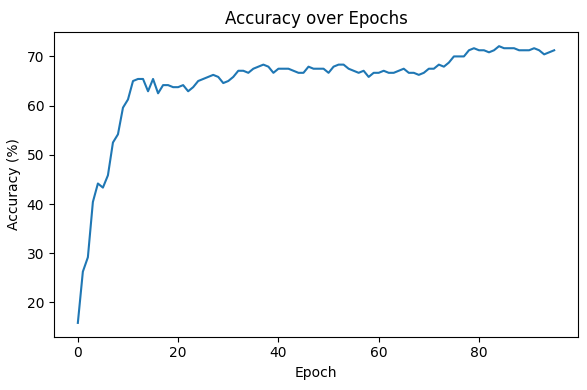
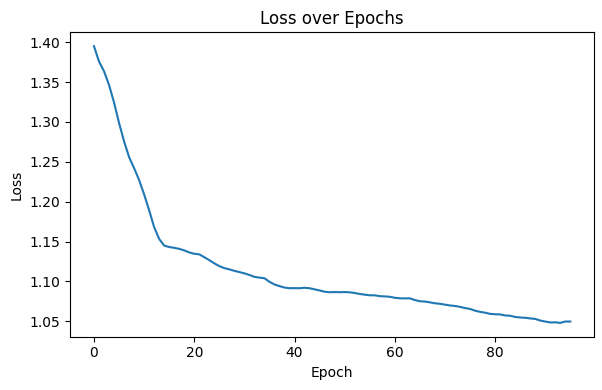
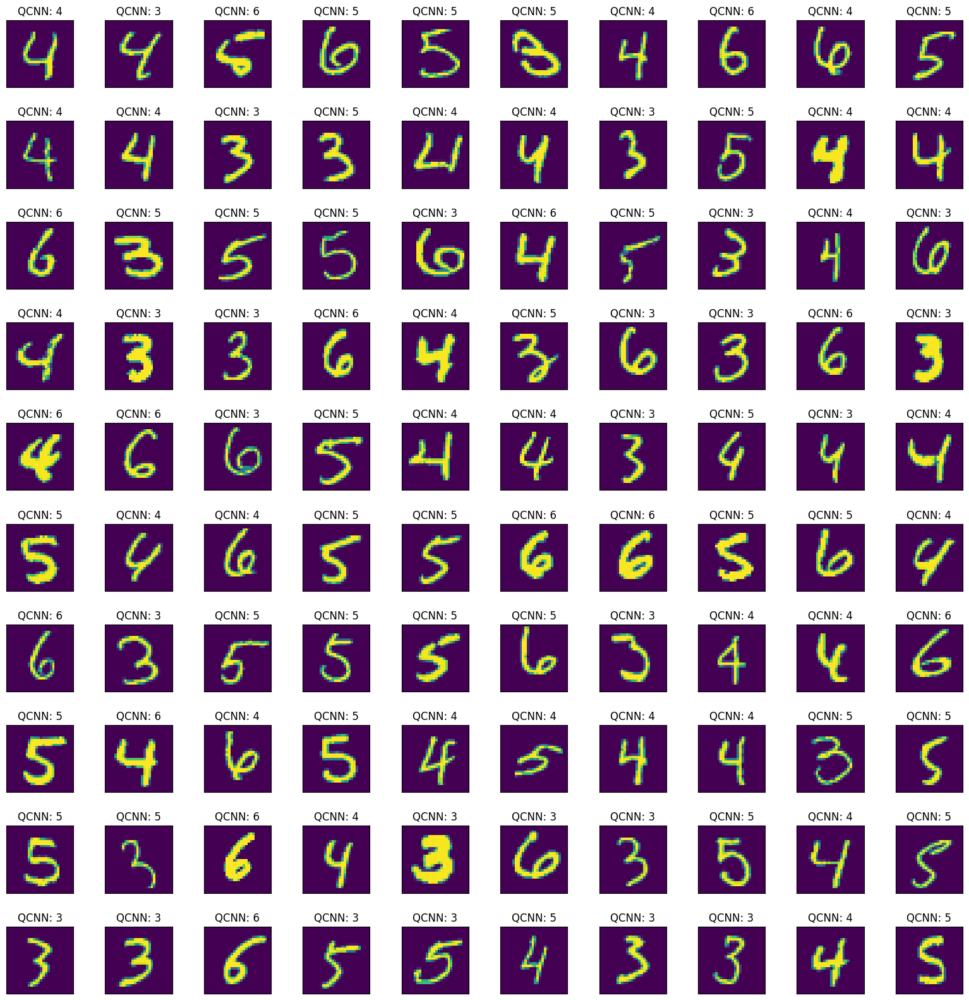

# Multiclass QCNN Research (Fully Quantum)
Implementation of multi-class quantum convolutional neural network (without classical layers).

### Paper Link (In Progress)

## Goal
Implementing and comparing different quantum circuit architectures and analyzing current constraints in gradient calculation of quantum circuits.

## Input
Input in all cases is an MNIST dataset consisting of handwritten digits. To represent the classical data for quantum processing, we reduce the image dimensions from 28x28 image
<table>
  <tr>
    <td></td>
  </tr>
</table>

to 4x4 image so that we can use 16 qubits to represent 1 image. The images are processed through the ZFeatureMap, which encodes classical data into a quantum representation that can then be processed by the quantum algorithm.
<table>
  <tr>
    <td></td>
  </tr>
</table>

## Sample Circuit Used
<table>
  <tr>
    <td></td>
  </tr>
</table>

## Algorithms
[Gradient Free Optimizer](<GPU/V4 (FINAL TESTING)/Circuit 1/Estimator 4 Classes Circuit 1 (256 Batch)/4Qubits(NoEndConv).ipynb>) - Gradient Free Optimizer Test (Best Performing)
<table>
  <tr>
    <td></td>
    <td></td>
  </tr>
</table>

 

[Gradient Based Optimizer](<GPU/V4 (FINAL TESTING)/Gradient Testing/Circuit1/4 Classes/4Qubits(One_Hot)_ADAM_256_95Epoch.ipynb>) - Gradient Based Optimizer Test (Best Performing)
<table>
  <tr>
    <td></td>
    <td></td>
  </tr>
</table>

We use multiple circuits tested in the GPU File under the V4 (Final Testing) under different categories. Rest of directories are tests and represent the iterative work.

All Circuits Tested Accesible Below (Folders)
* [Gradient Free Optimizer](<GPU/V4 (FINAL TESTING)>) - Gradient Free Optimizer Testing
* [Gradient Based Optimizer](<GPU/V4 (FINAL TESTING)/Gradient Testing>) - Gradient Based Optimizer Testing (ReverseGradientEstimator)

## Output
<table>
  <tr>
    <td></td>
  </tr>
</table>

## Observations
Gradient Free calculation using COBYLA, which was found to demonstrate highest performance among gradient-free optimizers for this problem, demonstrated a significantly lower performance compared to Gradient Based calculation (similar to what is expected in classical machine learning). If the pattern of increasing divergence between model accuracies from the 2-class simpler scenario to the 4-class scenario continues, it could indicate that more complicated quantum machine learning architectures with thousands or millions of parameters would require gradient-based optimizers. This could be a significant bottleneck as gradient calculation, even on quantum computers with very high coherence times, scale linearly with parameters: O(n). However, the final results (60% / 70%) on this complex problem indicated that there is potential to find gradient-free methods to better traverse the Hilbert Space.

## Future Aim / Next Steps
--To Be Filled Later--
